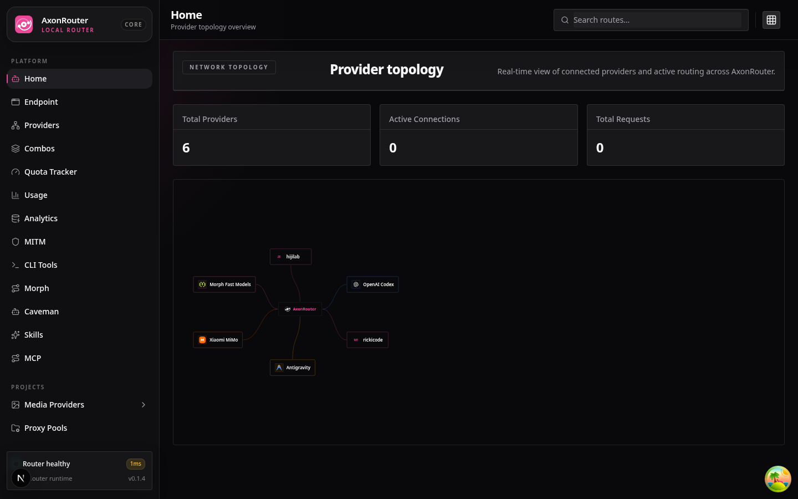

<div align="center">
  

  # AxonRouter

  **Route AI coding tools across providers.**

  Use one local router for Claude Code, Codex, Cursor, Cline, OpenClaw, and compatible clients, with provider fallback, protocol translation, and dashboard control.

  [Quick Start](#quick-start) · [Run Options](#run-options) · [Client Setup](#client-setup) · [Docs](./docs/DOCS.md)
</div>

---

## What Is AxonRouter?

AxonRouter runs on your machine and exposes one AI routing endpoint:

```text
http://localhost:12711/v1
```

Use it to connect coding tools to multiple AI providers without reconfiguring every client.

| Built For | What It Provides |
|-----------|------------------|
| AI routing | One endpoint for many coding tools |
| Provider management | OAuth providers, API-key providers, model aliases, and combos |
| Fallback flows | Move between configured models/providers when needed |
| Visibility | Usage, request logs, route diagnostics, and provider status |
| Production safety | Dashboard auth, API-key controls, audit logs, and local SQLite storage |

Runtime data is stored in `~/.axonrouter` on macOS/Linux and `%APPDATA%\axonrouter` on Windows.

---

## Quick Start

### Run Options

Choose one:

- **Run directly** with pnpm when AxonRouter should run on your machine as a local app.
- **Run with Docker** when you want an isolated service with a mounted `~/.axonrouter` data directory.

### Run Directly

#### pnpm

```bash
pnpm install -g axonrouter
axonrouter
```

MCP stdio mode uses same binary:

```bash
axonrouter mcp
```

`axonrouter` starts core app and includes HTTP MCP endpoints such as `/api/mcp/stream`.
`axonrouter mcp` is stdio adapter for MCP clients and expects core app to already be running.

Run without global install:

```bash
npx axonrouter
```

### Open The Dashboard

```text
Dashboard: http://localhost:12711/dashboard
API:       http://localhost:12711/v1
```

Default port is `12711`.

First-run dashboard password is `12345677`. Sign in once, then change it immediately in **Settings -> Security**.

### Docker

```bash
docker build -t axonrouter .
docker run -d \
  --name axonrouter \
  -p 12711:12711 \
  -v "$HOME/.axonrouter:/home/node/.axonrouter" \
  axonrouter
```

Docker stores runtime data in the mounted `~/.axonrouter` directory.

---

## First Setup

1. Open `http://localhost:12711/dashboard`.
2. Sign in with the default dashboard password `12345677`.
3. Change the dashboard password in **Settings -> Security**.
4. Add a provider in **Providers**.
5. Optionally create an API key in **Keys**.
6. Optionally create a fallback combo in **Combos**.
7. Point your tool at `http://localhost:12711/v1`.

AxonRouter does not support env-based dashboard password overrides. API-key routing is open by default until you create or configure an AxonRouter API key; after that, use keys from **Keys** for clients that call `/v1`.

---

## Client Setup

Use these values in OpenAI-compatible clients:

```text
Base URL: http://localhost:12711/v1
API Key:  [copy from Dashboard -> Keys, or omit before any AxonRouter API key is set up]
Model:    [model id or combo name]
```

Examples:

| Tool | Recommended Setup |
|------|-------------------|
| Claude Code | Use Dashboard -> CLI Tools -> Claude Code |
| Codex CLI | Set `OPENAI_BASE_URL=http://localhost:12711` and `OPENAI_API_KEY` |
| Cursor / Cline / Continue | Use provider type `OpenAI Compatible` |
| OpenClaw | Use Dashboard -> CLI Tools -> OpenClaw |

More tool-specific notes are in [docs/DOCS.md](./docs/DOCS.md).

---

## Core Features

- **AI router** for OpenAI-compatible clients and Anthropic/Claude-style flows.
- **Provider routing** across OAuth providers, API-key providers, aliases, and fallback combos.
- **Format translation** between OpenAI, Claude, Gemini, and Responses-style flows.
- **Usage visibility** with token/request stats, request details, and route diagnostics.
- **Security controls** for dashboard auth, API keys, protected management routes, and audit logs.
- **Docker/VPS support** for persistent self-hosted deployments.

---

## Service Management

AxonRouter can be installed as a system service for automatic startup:

```bash
# Install as system service (requires root/sudo)
sudo axonrouter install-service

# Check service status
axonrouter check-service

# Service control
sudo axonrouter start
sudo axonrouter stop
sudo axonrouter restart

# Remove service
sudo axonrouter uninstall-service
```

Commands also work with `--` flags: `--install-service`, `--check-service`, `--start`, `--stop`, `--restart`, `--uninstall-service`.

Features:
- Auto-detects systemd or init.d
- Auto-replaces existing service if present
- Enables auto-start on boot
- Requires root/sudo (clear error message if not root)

---

## Install From Source

```bash
git clone https://github.com/rickicode/AxonRouter.git
cd AxonRouter
pnpm install
pnpm run build
pnpm run start
```

---

## More Documentation

- [docs/DOCS.md](./docs/DOCS.md) - setup, providers, combos, deployment, security, and API notes.
- [docs/ARCHITECTURE.md](./docs/ARCHITECTURE.md) - internal architecture.

---

## Validation

```bash
pnpm run lint
pnpm run typecheck
pnpm run test
pnpm run build
```

---

## License

MIT License. See [LICENSE](./LICENSE).
