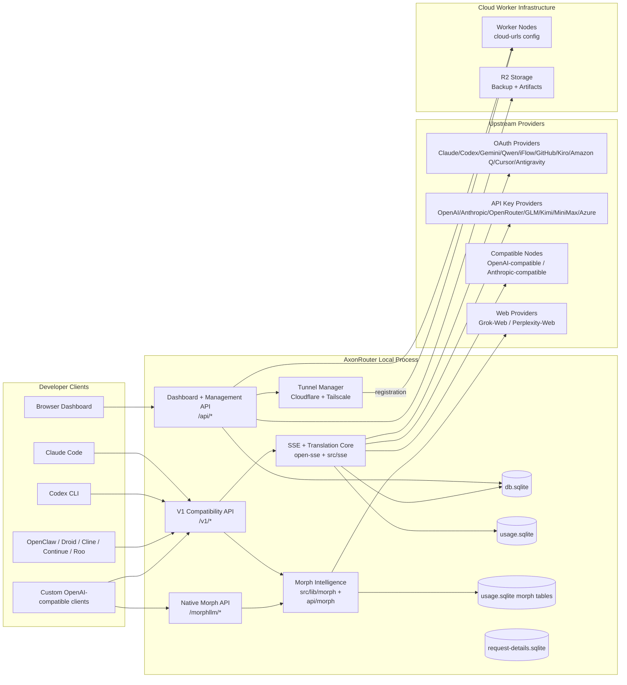
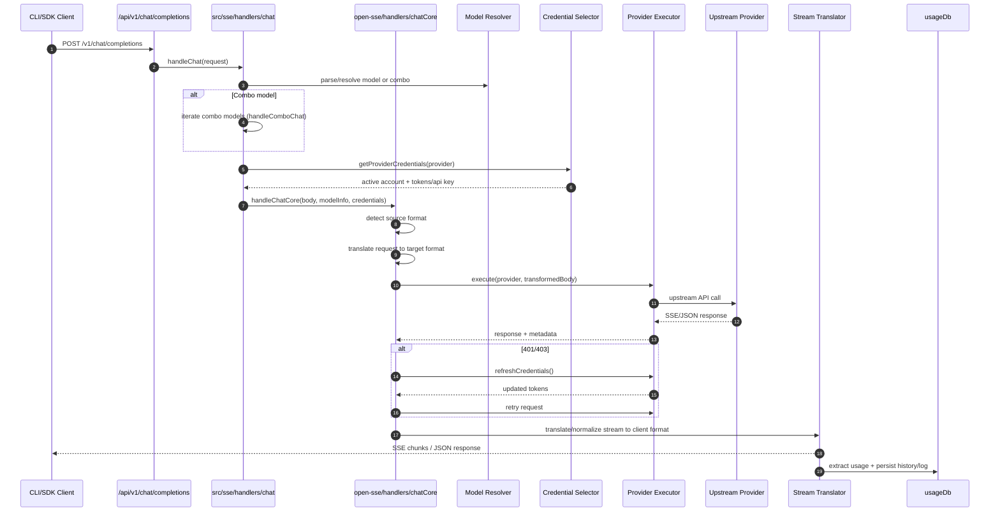
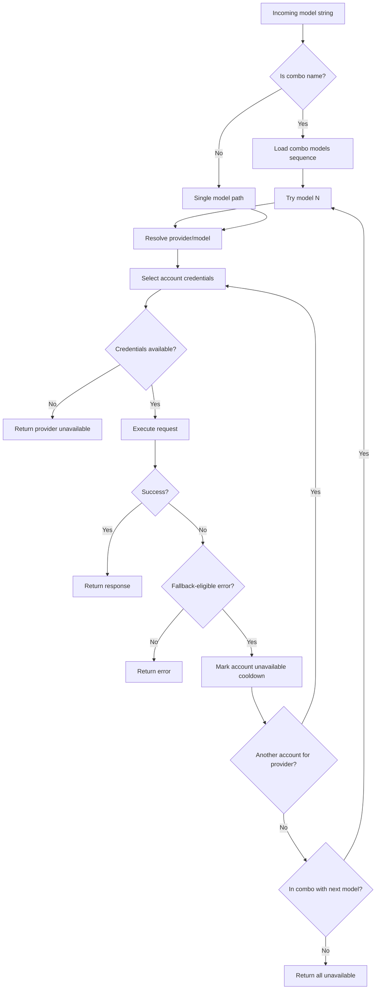
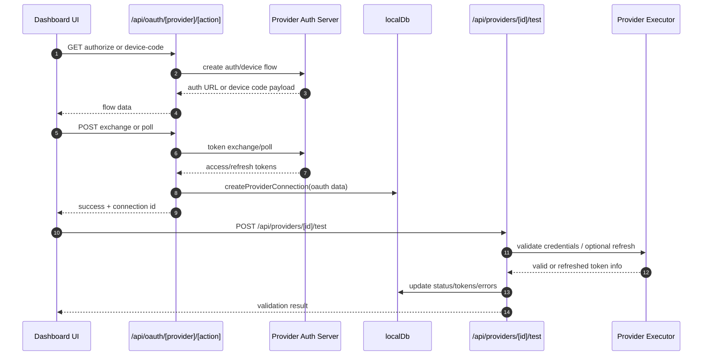
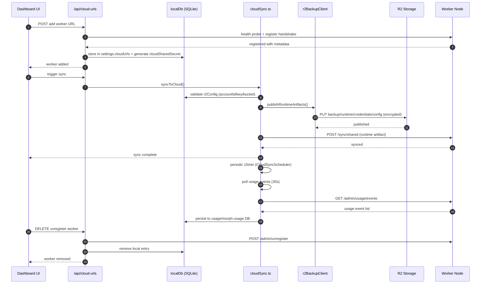
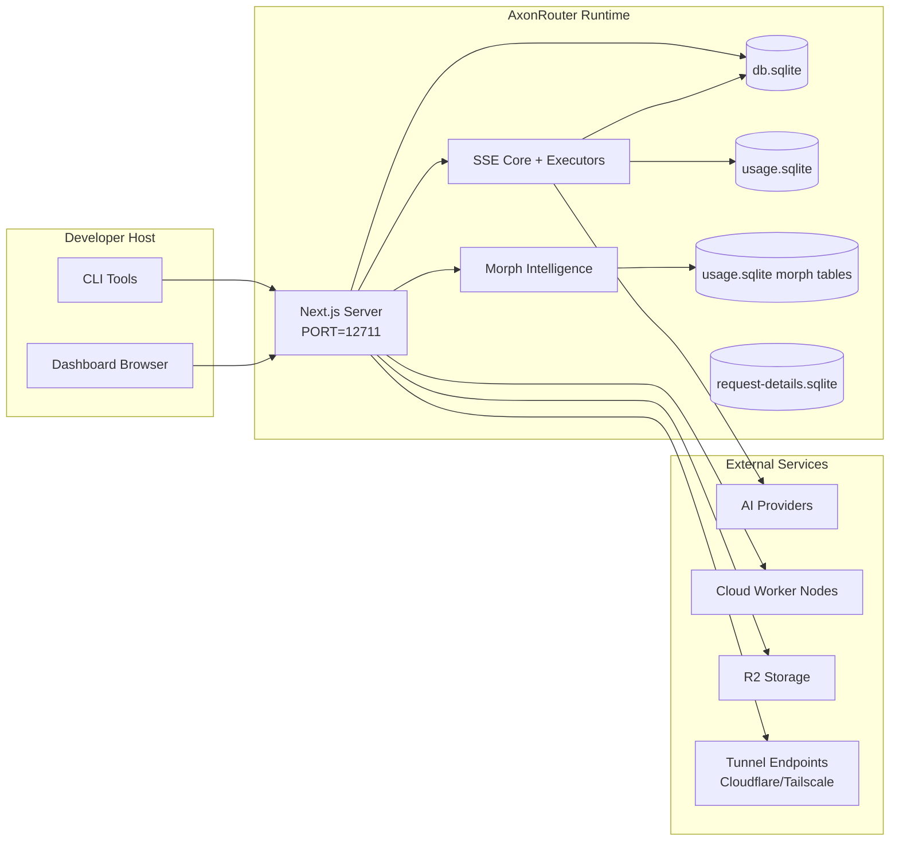
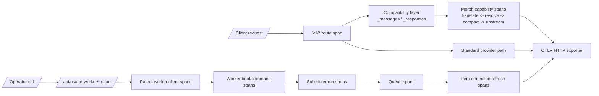

# AxonRouter Architecture

_Last updated: 2026-05-22_

## Executive Summary

AxonRouter is an AI router and dashboard built on Next.js.
It provides an OpenAI-compatible endpoint surface (`/v1/*`) plus a native Morph surface (`/morphllm/*`) on the local AxonRouter runtime (default `http://localhost:12711`) and routes traffic across multiple upstream providers with translation, fallback, token refresh, and usage tracking.

Core capabilities:

- OpenAI-compatible API surface for CLI/tools
- Request/response translation across provider formats
- Model combo fallback (multi-model sequence)
- Account-level fallback (multi-account per provider)
- OAuth + API-key provider connection management
- Local persistence for providers, keys, aliases, combos, settings, pricing
- Usage/cost tracking and request logging
- Optional cloud sync for multi-device/state sync
- Morph intelligence layer (auto-routing, key failover, instruction injection, reasoning normalization)
- Caveman control surface with implemented dashboard/config/modifier layers active on the main chat request pipeline for translated and native passthrough chat paths
- Tunnel system (Cloudflare Quick Tunnel + Tailscale Funnel) for remote access
- R2 backup/restore with encrypted SQLite artifacts
- SQLite-backed primary state store with migration from JSON
- Custom skills CRUD and import/export
- Usage worker system with prioritized batch scheduling
- Proxy pools for provider connection outbound routing
- npm distribution with standalone Next.js output and a single `axonrouter` CLI; local MCP stdio runs through `axonrouter mcp`

Primary runtime model:

- Next.js app routes under `src/app/api/*` implement both dashboard APIs and compatibility APIs
- A shared SSE/routing core in `src/sse/*` + `open-sse/*` handles provider execution, translation, streaming, fallback, and usage
- Runtime defaults are centralized in `src/shared/constants/runtimeDefaults.json` and imported by both app runtime and MITM code

## Scope and Boundaries

### In Scope

- Local router runtime
- Dashboard management APIs
- Provider authentication and token refresh
- Kiro-compatible multi-provider surface for both `kiro` and `amazon-q`
- Request translation and SSE streaming
- Local state + usage persistence (SQLite-backed with JSON migration)
- Cloud worker sync with R2 artifact publication
- Morph intelligence layer (auto-routing, key failover, instruction injection, reasoning)
- Caveman concise-output controls with dashboard/config support active on the main chat request pipeline
- Tunnel system (Cloudflare Quick Tunnel + Tailscale Funnel)
- R2 backup/restore with encrypted SQLite artifacts
- Custom skills management (CRUD, import/export)
- Usage worker scheduling with prioritized batching
- Proxy pools for outbound provider routing
- Opencode sync integration
- Internal proxy tokens for credential resolution

### Out of Scope

- Cloud worker service implementation behind worker URLs
- Provider SLA/control plane outside local process
- External CLI binaries themselves (Claude CLI, Codex CLI, etc.)
- Cloudflare/Tailscale infrastructure (only client-side tunnel management)

## High-Level System Context



## Core Runtime Components

## 1) API and Routing Layer (Next.js App Routes)

Main directories:

- `src/app/api/v1/*` and `src/app/api/v1beta/*` for compatibility APIs
- `src/app/morphllm/*` for native Morph HTTP routes (`/morphllm/*` and `/morphllm/v1/*`)
- `src/app/api/*` for management/configuration APIs
- Next rewrites in `next.config.ts` map `/v1/*` to `/api/v1/*`

Important compatibility routes:

- `src/app/api/v1/chat/completions/route.ts`
- `src/app/api/v1/messages/route.ts`
- `src/app/api/v1/responses/route.ts`
- `src/app/api/v1/models/route.ts`
- `src/app/api/v1/embeddings/route.ts`
- `src/app/api/v1/audio/*`
- `src/app/api/v1/images/generations/route.ts`
- `src/app/api/v1/video/generations/route.ts`
- `src/app/api/v1/unified/route.ts`
- `src/app/api/v1/messages/count_tokens/route.ts`
- `src/app/api/v1beta/models/route.ts`
- `src/app/api/v1beta/models/[...path]/route.ts`
- Native Morph: `src/app/morphllm/chat/completions/route.ts`, `src/app/morphllm/models/route.ts`, `src/app/morphllm/compact/route.ts`, plus `/morphllm/v1/*` variants

Management domains:

- Auth/settings: `src/app/api/auth/*`, `src/app/api/settings/*`
- Providers/connections: `src/app/api/providers*` (includes `/providers/morph/*`, `/providers/codex/*`, `/providers/commandcode/*`, `/providers/kilo/*`; Kiro-compatible model listing paths are reused by both `kiro` and `amazon-q`)
- Provider nodes: `src/app/api/provider-nodes*`
- OAuth: `src/app/api/oauth/*` (includes Kiro-compatible flows reused by both `kiro` and `amazon-q`)
- Keys/aliases/combos/pricing: `src/app/api/keys*`, `src/app/api/models`, `src/app/api/combos*`, `src/app/api/pricing`
- Usage: `src/app/api/usage/*`, `src/app/api/usage-worker/*`
- Cloud/worker URLs: `src/app/api/cloud-urls/*` (replaced old `/api/sync/*` and `/api/cloud/*`)
- R2 backup/restore: `src/app/api/r2/*`
- CLI tooling helpers: `src/app/api/cli-tools/*`
- Tunnel: `src/app/api/tunnel/*` (Cloudflare Quick Tunnel + Tailscale Funnel)
- Morph: `src/app/api/morph/*` (Morph capability dispatch)
- Skills: `src/app/api/skills/*` (custom skills CRUD)
- Tags: `src/app/api/tags/*` (Ollama model tags)
- Plugin: `src/app/api/plugin/*` (plugin usage summary)
- Media providers: `src/app/api/media-providers/*` (TTS/ElevenLabs voices)
- Credentials: `src/app/api/credentials/*` (import/export)
- Internal proxy: `src/app/api/internal/proxy/*` (resolve/report tokens)
- Translator: `src/app/api/translator/*` (console logs, load/save/send/translate)
- Routing latency: `src/app/api/routing/latency/*`
- Opencode: `src/app/api/opencode/*`
- Health/init/shutdown/version: operational endpoints
- Proxy pools: `src/app/api/proxy-pools/*`
- MCP + protocol surfaces: `src/app/api/mcp/*`, `src/app/api/protocols/*`
- Operational intelligence: `src/app/api/incidents/*`, `src/app/api/evals/*`, `src/app/api/outcome-intelligence/*`
- Media/audio: `src/app/api/v1/audio/*`

## 2) SSE + Translation Core

Main flow modules:

- Entry: `src/sse/handlers/chat.ts`
- Core orchestration: `open-sse/handlers/chatCore.ts`
- Provider execution adapters: `open-sse/executors/*`
- Format detection/provider config: `open-sse/services/provider.ts`
- Model parse/resolve: `src/sse/services/model.ts`, `open-sse/services/model.ts`
- Curated provider model aliases in `open-sse/config/providerModels.ts` now include both `kr` (Kiro) and `aq` (Amazon Q)
- Account fallback logic: `open-sse/services/accountFallback.ts`
- Translation registry: `open-sse/translator/index.ts`
- Prompt modifiers: Caveman Mode is wired into the main chat pipeline for canonical `source -> OpenAI -> target` translation and native passthrough body shapes
- Stream transformations: `open-sse/utils/stream.tsx`, `open-sse/utils/streamHandler.ts`
- Usage extraction/normalization: `open-sse/utils/usageTracking.ts`
- Kiro-compatible usage + refresh handlers are shared across `kiro` and `amazon-q` in `open-sse/services/usage.ts` and `open-sse/services/tokenRefresh.ts`

## 3) Persistence Layer

Primary state DB (SQLite-backed):

- `src/lib/localDb.ts` — SQLite-first with JSON migration path
- Primary file: `~/.axonrouter/db.sqlite` (with `sqliteHelpers.ts` and `sqliteMigrations.ts`)
- Driver: `better-sqlite3`. Published npm packages include the standalone native binary and Turbopack external alias; `node-gyp` is dependency-level fallback for platforms that must rebuild the native addon.
- Collections: providerConnections, providerNodes, proxyPools, modelAliases, customModels, disabledModels, customSkills, mitmAlias, combos, apiKeys, settings, pricing
- Provider identity is data-driven, so `kiro` and `amazon-q` connections persist separately even though they share most OAuth/executor mechanics
- Singletons: opencodeSync, runtimeConfig, tunnelState
- Hot-state table: `hot_state` in SQLite with metadata-version invalidation (`src/lib/providerHotState.ts`)
- JSON migration: automatic `migrateFromJSON` on bootstrap

Usage DB:

- `src/lib/usageDb.ts`
- primary file: `~/.axonrouter/usage.sqlite`
- legacy fallback reads may still consult `~/.axonrouter/usage.json` for older data, but active writes flow through SQLite
- Features: daily summary rollups (by provider/model/account/apiKey/endpoint), lifetime request counts, observability modes (off/minimal/sampled/full), request log batching/trim

Morph Usage DB:

- `src/lib/morphUsageDb.ts`
- storage: Morph usage now persists into the shared `~/.axonrouter/usage.sqlite` database via dedicated morph usage tables
- Tracks Morph-specific dimensions: capability (apply/warpgrep/compact/embeddings/rerank), entrypoint, source, method, model resolution, credits/dollars

Request Details DB:

- `src/lib/requestDetailsDb/*`
- file: `~/.axonrouter/request-details.sqlite`
- Rich diagnostic records: provider/model/connection/timestamp/status, latency, tokens, request/response payloads
- Payload storage helpers, background write queue, SQLite migrations, and configurable retention controls

R2 Backup/Restore:

- `src/lib/r2BackupClient.ts`, `r2BackupScheduler.ts`, `r2ObjectClient.ts`, `r2RuntimeArtifacts.ts`
- Scheduled backup cadence: daily/weekly/monthly
- Artifacts: backup, runtime, eligible, credentials, runtimeConfig, SQLite binary
- AES-256-GCM encrypted envelopes for JSON and SQLite artifacts
- SQLite fingerprint-based change detection, artifact hash deduplication
- Direct restore from signed private R2 objects

## 4) Auth + Security Surfaces

- Dashboard cookie auth: `src/proxy.ts`, `src/app/api/auth/login/route.ts`
- Dashboard management auth uses PASETO session cookies with generated/persisted keypairs
- Local trusted requests can bypass the dashboard login prompt for management setup flows
- IP-based rate limiting on login (5 attempts per 5 min, 429 + Retry-After)
- Security audit logging: `src/lib/security/auditLog.ts` (JSON-line file, rotated up to 3 files, 10MB threshold)
- Tunnel access control: `isTunnelRequest()` blocks auth for tunnel hosts unless `tunnelDashboardAccess` is enabled
- API key generation/verification: `src/shared/utils/apiKey.ts`
- Internal proxy tokens: `src/lib/internalProxyTokens.ts` (32-byte resolve/report tokens, 30s TTL cache)
- IP whitelist/CIDR validation: `src/lib/security/ipValidator.ts`
- Provider secrets persisted in `providerConnections` entries
- Kiro-compatible OAuth routes can create either `kiro` or `amazon-q` connections via target-provider selection while sharing the same AWS Builder ID / imported refresh-token mechanics
- Optional proxy support for upstream calls via env proxy variables (`open-sse/utils/proxyFetch.ts`)

## 5) Cloud Worker Infrastructure (replaces old Cloud Sync model)

Worker Registry:

- `src/lib/cloudUrlResolver.ts` — dashboard-configured worker URLs (no env fallback)
- `src/lib/cloudRequestAuth.ts` — origin/CSRF validation for cloud routes
- `src/app/api/cloud-urls/*` — worker URL management (add/probe/register/unregister)
- Global `cloudSharedSecret` for worker authentication

Worker Client:

- `src/lib/cloudWorkerClient.ts` — worker admin protocol:
  - Health (`GET /admin/health`), registration (`POST /admin/register`)
  - Status/logs/runtime push/usage events/unregister

Cloud Sync Pipeline:

- `src/lib/cloudSync.ts` — two-stage sync:
  1. Publish runtime artifacts to private R2 (backup/runtime/eligible/credentials/runtimeConfig)
  2. Push runtime sync to each worker via `/sync/shared`
- Worker status tracking: online/offline/unauthorized/not_registered/error with latency

Cloud Usage Sync:

- `src/lib/cloudUsageSync.ts` — event-based usage pull per worker
- Cursor + dedup tracking in `settings.cloudUsageSync`
- Writes to local usage DB, request logs, and morph usage DB

Dual Usage Pathways:

- Snapshot poller: `src/shared/services/cloudUsagePoller.ts` (15s, `GET /worker/usage`)
- Event pull: `r2BackupScheduler` (30s, `GET /admin/usage/events`)

Schedulers:

- `src/shared/services/initializeApp.ts` — starts CloudSyncScheduler (15min), CloudUsagePoller, R2BackupScheduler
- `src/shared/services/cloudSyncScheduler.ts` — periodic `syncToCloud()`

## Request Lifecycle (`/v1/chat/completions`)



Runtime branches not shown in the diagram but implemented:

- **Morph passthrough mode**: client-tool detection (`isNativePassthrough`) can skip translation
- **Forced SSE→JSON adaptation**: OpenAI, commandcode, and some codex paths require stream conversion
- **Concurrency gating**: `tryAcquireChatSlot` / `attachChatSlotRelease` controls concurrent chat slots
- **Codex-first routing**: bare OpenAI model IDs can prefer codex provider first
- **Commandcode model slugging**: preserves normalized upstream slug differently
- **Provider-thinking override**: `providerThinking` injection in core path
- **Request normalization pipeline**: tool-call ID repair (`ensureToolCallIds`, `fixMissingToolResponses`)
- **Observability sampling**: request details logged based on observability mode/rate
- **OpenTelemetry tracing**: request-level spans wrap all `/v1/*` entrypoints, Morph capability dispatch phases, and usage worker lifecycle/jobs

## Combo + Account Fallback Flow



Fallback decisions are driven by `open-sse/services/accountFallback.ts` using status codes and error-message heuristics.

## OAuth Onboarding and Token Refresh Lifecycle



Refresh during live traffic is executed inside `open-sse/handlers/chatCore.ts` via executor `refreshCredentials()`.

## Cloud Worker Sync Lifecycle (replaces old single-endpoint model)



Periodic sync and usage pulls managed by `CloudSyncScheduler` + `R2BackupScheduler`.
R2 backup cadence: daily/weekly/monthly with SQLite fingerprint-based change detection.

## Data Model and Storage Map

```mermaid
erDiagram
    SETTINGS ||--o{ PROVIDER_CONNECTION : controls
    PROVIDER_NODE ||--o{ PROVIDER_CONNECTION : backs_compatible_provider
    PROVIDER_CONNECTION ||--o{ USAGE_ENTRY : emits_usage
    SETTINGS ||--o{ HOT_STATE : cache
    SETTINGS ||--o{ CLOUD_URL : registry
    SETTINGS ||--o{ R2_CONFIG : backup

    SETTINGS {
      boolean cloudEnabled
      number stickyRoundRobinLimit
      boolean requireLogin
      string password_hash
      json routing (strategy, sticky, provider/combo)
      json morph (config, instructions, chatRuntime)
      json r2 (config, backup timestamps, artifact hash, encryption key)
      json cloudUsageSync (cursors by worker, seen event IDs)
      json observability (mode, rate)
      string[] ipWhitelist
      boolean trustedProxyEnabled
      boolean auditLogEnabled
    }

    PROVIDER_CONNECTION {
      string id
      string provider
      string authType
      string name
      string routingStatus (eligible/inactive/error/...)
      string healthStatus
      string quotaState
      string authState
      number priority
      boolean isActive
      string apiKey
      string accessToken
      string refreshToken
      string expiresAt
      string testStatus
      string lastError
      string rateLimitedUntil
      json providerSpecificData
    }

    PROVIDER_NODE {
      string id
      string type
      string name
      string prefix
      string apiType
      string baseUrl
    }

    MODEL_ALIAS {
      string alias
      string targetModel
    }

    COMBO {
      string id
      string name
      string[] models
    }

    API_KEY {
      string id
      string name
      string key
      string runtimeScope
      boolean isActive
    }

    PROXY_POOL {
      string id
      string name
      string type
      json credentials
      string[] connectionIds
    }

    CUSTOM_SKILL {
      string id
      string name
      string trigger
      string content
    }

    CLOUD_URL {
      string id
      string url
      string status
      string lastProbeAt
    }

    HOT_STATE {
      string connectionId
      string provider
      string key
      json value
      number metaVersion
    }

    USAGE_ENTRY {
      string provider
      string model
      number prompt_tokens
      number completion_tokens
      string connectionId
      string timestamp
    }
```

Physical storage files:

- main state: `~/.axonrouter/db.sqlite` (SQLite, with JSON migration path)
- usage stats + request logs + morph usage: `~/.axonrouter/usage.sqlite`
- legacy usage fallback source: `~/.axonrouter/usage.json` when older pre-SQLite data exists
- request details: `~/.axonrouter/request-details.sqlite`
- audit log: `~/.axonrouter/audit.log` (when enabled)
- R2 artifacts: backup/runtime/credentials/runtimeConfig (encrypted)
- optional translator/request debug sessions: `<repo>/logs/...`

## Deployment Topology



## Module Mapping (Decision-Critical)

### Route and API Modules

- `src/app/api/v1/*`, `src/app/api/v1beta/*`: compatibility APIs
- `src/app/api/providers*`: provider CRUD, validation, testing, morph/codex/commandcode/kilo subdomains
- `src/app/api/provider-nodes*`: custom compatible node management
- `src/app/api/oauth/*`: OAuth/device-code flows
- `src/app/api/keys*`: local API key lifecycle
- `src/app/api/models`: model catalog + alias management
- `src/app/api/combos*`: fallback combo management
- `src/app/api/pricing`: pricing overrides for cost calculation
- `src/app/api/usage/*`: usage and logs APIs
- `src/app/api/usage-worker/*`: usage worker scheduling
- `src/app/api/cloud-urls/*`: cloud worker URL registry (replaces old `/api/sync/*` and `/api/cloud/*`)
- `src/app/api/r2/*`: R2 backup/restore configuration
- `src/app/api/cli-tools/*`: local CLI config writers/checkers
- `src/app/api/tunnel/*`: tunnel enable/disable/status
- `src/app/api/morph/*`: Morph capability dispatch
- `src/app/api/skills/*`: custom skills CRUD
- `src/app/api/tags/*`: Ollama model tags
- `src/app/api/plugin/*`: plugin usage summary
- `src/app/api/media-providers/*`: TTS/ElevenLabs voices
- `src/app/api/credentials/*`: credential import/export
- `src/app/api/internal/proxy/*`: internal proxy resolve/report
- `src/app/api/translator/*`: translator console logs and operations
- `src/app/api/routing/latency/*`: routing latency telemetry
- `src/app/api/opencode/*`: opencode sync integration
- `src/app/api/proxy-pools/*`: proxy pool management
- Operational: `health`, `init`, `shutdown`, `version`

### Routing and Execution Core

- `src/sse/handlers/`: multi-handler routing (chat, embeddings, imageGeneration, stt, tts)
  - `chat.ts`: request parse, combo handling, account selection loop, concurrency gating
  - `embeddings.ts`: embedding model routing
  - `imageGeneration.ts`: image generation routing
  - `stt.ts`: speech-to-text routing
  - `tts.ts`: text-to-speech routing
- `src/sse/services/`: SSE service layer
  - `auth.ts`: request authentication and API key validation
  - `model.ts`: model resolution and normalization
  - `tokenRefresh.ts`: token refresh during request lifecycle
- `open-sse/handlers/`: Open-SSE core handlers
  - `chatCore.ts`: translation, executor dispatch, retry/refresh, stream setup, provider-thinking injection
  - `chatCore/nonStreamingHandler.ts`: non-streaming request handling
  - `chatCore/streamingHandler.ts`: SSE streaming handler
  - `chatCore/sseToJsonHandler.ts`: SSE-to-JSON conversion (OpenAI/commandcode paths)
  - `chatCore/requestDetail.ts`: request detail capture
  - `embeddingsCore.tsx`: embedding model execution
  - `imageGenerationCore.ts`: image generation execution
  - `sttCore.ts`: speech-to-text execution
  - `ttsCore.tsx`: text-to-speech execution
  - `responsesHandler.ts`: OpenAI responses API handler
- `open-sse/services/`: Open-SSE service layer
  - `accountFallback.ts`: account-level fallback logic
  - `combo.ts`: combo model sequence management
  - `compact.ts`: context compaction
  - `model.ts`: model resolution
  - `projectId.ts`: project ID extraction and caching
  - `provider.ts`: provider routing and selection
  - `tokenRefresh.ts`: provider token refresh orchestration
  - `usage.ts`: usage extraction and aggregation
- `open-sse/utils/`: Open-SSE utilities
  - `abort.ts`: request abort management
  - `bypassHandler.ts`: bypass mode handling
  - `claudeCloaking.tsx` + `claudeHeaderCache.ts`: Claude header cloaking
  - `clientDetector.ts`: client detection
  - `cursorChecksum.ts` + `cursorProtobuf.ts`: Cursor protobuf handling
  - `error.ts`: error formatting
  - `ollamaTransform.ts`: Ollama format transformation
  - `proxyFetch.ts`: outbound proxy support
  - `requestLogger.tsx`: deep request logging
  - `sessionManager.ts`: session management
  - `stream.tsx` + `streamHandler.ts` + `streamHelpers.ts`: stream processing
  - `usageTracking.ts`: per-request usage tracking
- `open-sse/transformer/`: response transformers
  - `responsesTransformer.ts`: OpenAI responses format transform
  - `streamToJsonConverter.ts`: SSE-to-JSON stream conversion
- `open-sse/config/`: configuration layer
  - `providers.ts` + `providerModels.ts`: provider definitions and models
  - `codexInstructions.ts` + `codexInstructionsResolver.ts`: Codex system instructions
  - `commandcodeInstructions.ts` + `commandcodeInstructionsResolver.ts`: Commandcode instructions
  - `morphInstructions.ts` + `morphInstructionsResolver.ts`: Morph instructions
  - `agentToolAwareness.ts`: agent tool awareness
  - `appConstants.ts` + `constants.ts`: application constants
  - `defaultThinkingSignature.ts`: thinking mode signatures
  - `errorConfig.ts`: provider error classification
  - `googleTtsLanguages.ts` + `ttsModels.ts`: TTS language/model config
  - `models.ts` + `ollamaModels.ts`: model definitions
  - `runtimeConfig.ts`: runtime configuration
- `open-sse/runtime/`: runtime utilities
  - `usagePersistence.ts`: usage persistence during streaming
- `open-sse/executors/*`: provider-specific network and format behavior
- `src/app/api/v1/*_morph*.ts`: Morph compatibility layer (responses/messages routing)
- `src/app/api/v1/_morphRoute.tsx`: Morph route dispatcher
- `src/app/api/v1/_morphThink.ts`: Morph think-tag handler
- `src/app/api/v1/_sharedRouteHandler.ts`: shared route utilities for Morph paths
- `src/app/api/morph/_dispatch.ts`: Morph capability dispatcher with key failover
- `src/app/api/morph/_shared.ts`: shared Morph utilities

### Translation Registry and Format Converters

- `open-sse/translator/index.ts`: translator registry and orchestration (lazy init, cloaking, tool-call repair)
- Request translators: `open-sse/translator/request/*`
- Response translators: `open-sse/translator/response/*`
- Format constants: `open-sse/translator/formats.ts`

### Persistence

- `src/lib/localDb.ts`: persistent config/state (SQLite-first, JSON migration)
- `src/lib/sqliteHelpers.ts`: SQLite driver abstraction (better-sqlite3)
- `src/lib/sqliteMigrations.ts`: versioned schema migrations
- `src/lib/usageDb.ts`: usage history and rolling request logs
- `src/lib/morphUsageDb.ts`: Morph-specific usage tracking stored in the shared usage SQLite database
- `src/lib/requestDetailsDb.ts`: rich request/response diagnostic records
- `src/lib/observability/otel.ts`: OpenTelemetry manager for request spans, Morph nested spans, worker/job spans, streaming lifecycle timing, and settings-aware exporter reload
- `src/lib/providerHotState.ts`: hot state in SQLite with metadata invalidation
- `src/lib/dataDir.ts`: AxonRouter home storage path resolution
- `src/lib/hotStateKeys.ts`: hot state key definitions
- `src/lib/r2BackupClient.ts`: R2 backup/restore client
- `src/lib/r2BackupScheduler.ts`: scheduled backup/usage sync
- `src/lib/r2ObjectClient.ts`: SigV4 R2 object operations
- `src/lib/r2RuntimeArtifacts.ts`: runtime artifact building
- `src/lib/r2SqliteFingerprint.ts`: SQLite fingerprint for R2 change detection
- `src/lib/usageStatus.ts`: usage status tracking and aggregation
- `src/lib/usageRefreshQueue.ts`: usage refresh queue management
- `src/lib/connectionUsageRefresh.ts`: connection usage refresh
- `src/lib/connectionStatus.ts`: connection status tracking
- `src/lib/runtimeConfig.ts`: runtime configuration
- `src/lib/toolNameSanitizer.ts`: tool name sanitization for compatibility
- `src/lib/cloudRequestAuth.ts`: cloud request authentication
- `src/lib/cloudUrlResolver.ts`: cloud URL resolution
- `src/lib/appUpdater.ts`: application update detection
- `src/lib/consoleLogBuffer.ts`: console log buffering
- `src/lib/initCloudSync.ts`: cloud sync initialization

### Shared Component Library (`src/shared/`)

- `src/shared/components/`: 40+ dashboard UI components
  - Layouts: `AuthLayout.tsx`, `DashboardLayout.tsx`
  - Auth modals: `CursorAuthModal`, `GitLabAuthModal`, `KiroAuthModal`, `KiroOAuthWrapper`, `KiroSocialOAuthModal`, `IFlowCookieModal`, `OAuthModal`, `ManualConfigModal`
  - `KiroOAuthWrapper` and related Kiro auth modals are reused for both `kiro` and `amazon-q`
  - UI primitives: `Avatar`, `Badge`, `Button`, `Card`, `Input`, `Modal`, `Drawer`, `Pagination`, `SegmentedControl`, `Select`, `Toggle`, `Tooltip`, `Loading`
  - Dashboard: `Sidebar`, `Header`, `HeaderMenu`, `UsageStats`, `ModelSelectModal`, `PricingModal`, `RequestLogger`
  - Branding: `AppIcon`, `ProviderIcon`, `NineRemoteButton`, `NineRemotePromoModal`, `ChangelogModal`
  - Settings: `ProfileSettingsContent`
  - Language/Theme: `LanguageSwitcher`, `ThemeToggle`, `ThemeProvider`
  - Navigation: `Footer`
- `src/shared/constants/`: configuration constants
  - `cliTools.ts`: CLI tool definitions
  - `dashboardNavigation.ts`: dashboard navigation structure
  - `providers.ts` + `models.ts`: provider and model definitions
  - Free-provider catalog now includes both `kiro` and `amazon-q` as separate provider surfaces
  - `pricing.ts`: pricing data
  - `skills.ts`: skill configuration
  - `ttsProviders.ts`: TTS provider definitions
  - `colors.ts`, `config.ts`, `site.ts`: UI/site configuration
- `src/shared/utils/`: shared utilities
  - `api.tsx` + `apiKey.ts`: API utilities
  - `clineAuth.ts`: Cline authentication
  - `cloud.ts`: cloud utilities
  - `machineId.tsx` + `machine.ts`: machine ID generation
  - `providerModelsFetcher.ts`: provider model fetching
  - `cn.ts`: className merging utility
- `src/shared/hooks/`: React hooks
  - `useDashboardQuery.ts`: dashboard query utilities
  - `useTheme.ts`: theme management
  - `useUrlQueryControls.ts`: URL query controls
  - `useCopyToClipboard.ts`: clipboard utility
- `src/shared/services/`: shared services
  - `cloudSyncScheduler.ts`: cloud sync scheduling
  - `cloudUsagePoller.ts`: cloud usage polling
  - `initializeApp.ts`: application initialization
  - `initializeCloudSync.ts`: cloud sync initialization

## Provider Executor Coverage

Specialized executors:

- `antigravity`
- `azure`
- `gemini-cli`
- `github`
- `iflow`
- `qoder`
- `kiro`
- `codex`
- `cursor` (alias: `cu`)
- `vertex` (also: `vertex-partner`)
- `qwen`
- `opencode`
- `opencode-go`
- `grok-web`
- `perplexity-web`

Default executor path:

- providers not in the specialized map are routed to `open-sse/executors/default.ts` and cached per provider

## Format Translation Coverage

Detected source formats include:

- `openai`
- `openai-responses`
- `claude`
- `gemini`

Target formats include:

- OpenAI chat/Responses
- Claude
- Gemini/Gemini-CLI/Antigravity envelope
- Kiro
- Cursor
- Commandcode (request + response)
- Ollama (request + response)
- Vertex (request)

Translation pipeline includes:

- Source → OpenAI intermediate → Target normalization
- Tool-call ID repair (`ensureToolCallIds`, `fixMissingToolResponses`)
- Provider-specific cloaking hooks (Claude, Antigravity)
- OpenAI-responses in-place normalization when same-format

Translations are selected dynamically based on source payload shape and provider target format.

## Failure Modes and Resilience

## 1) Account/Provider Availability

- provider account cooldown on transient/rate/auth errors
- account fallback before failing request
- combo model fallback when current model/provider path is exhausted

## 2) Token Expiry

- pre-check and refresh with retry for refreshable providers
- 401/403 retry after refresh attempt in core path

## 3) Stream Safety

- disconnect-aware stream controller
- translation stream with end-of-stream flush and `[DONE]` handling
- usage estimation fallback when provider usage metadata is missing

## 4) Cloud Worker Degradation

- sync errors are surfaced but local runtime continues
- worker status persisted (online/offline/unauthorized/not_registered/error)
- scheduler has retry-capable logic, single-attempt sync by default
- R2 publish failures block sync but do not stop local operation

## 5) Data Integrity

- SQLite schema migration + index repair on bootstrap
- JSON→SQLite migration with validation
- corrupt JSON reset safeguards for localDb and usageDb
- R2 restore creates local DB backup before replacement

## 6) Tunnel Resilience

- Cloudflare tunnel reconnect backoff (5s→10s→20s→30s→60s)
- Tailscale daemon auto-start with login recovery
- Manual disable vs unexpected exit distinction prevents reconnect storms

## 7) Morph Key Failover

- API key round-robin with cursor per rotation key
- retryable error detection (status codes + error messages)
- key health transitions (pending→exhausted→cooldown→usable)
- usage-based exhaustion tracking with automatic status updates

## Observability and Operational Signals

Runtime visibility sources:

- console logs from `src/sse/utils/logger.ts`
- per-request usage aggregates in `usage.sqlite` (daily rollups by provider/model/account/apiKey/endpoint)
- request log rows in `usage.sqlite`
- request details store in `request-details.sqlite` (configurable sampling/retention)
- morph usage in `usage.sqlite` (capability/model/key/entrypoint breakdown)
- routing latency telemetry via `/api/routing/latency` (ring buffer, quantile stats)
- security audit log in `audit.log` (login events, IP-based rate limiting)
- optional deep request/translation logs under `logs/` when `ENABLE_REQUEST_LOGS=true`

## Security-Sensitive Boundaries

- Dashboard session auth uses PASETO tokens signed by generated/persisted local keypairs
- API key HMAC secret (`API_KEY_SECRET`) secures generated local API key format
- Provider secrets (API keys/tokens) are persisted in local DB and should be protected at filesystem level
- Cloud worker endpoints rely on `cloudSharedSecret` for authentication
- R2 encryption key (`r2BackupEncryptionKey`) protects backup artifacts (AES-256-GCM)
- Internal proxy tokens (`resolveToken`/`reportToken`) for credential resolution
- Tunnel access control: `tunnelDashboardAccess` flag blocks dashboard auth from tunnel hosts
- IP whitelist (`ipWhitelist` + CIDR matching) with trusted proxy mode (`trustedProxyEnabled`)
- Audit logging (`auditLogEnabled`) with log rotation (3 files, 10MB threshold)
- Login rate limiting (5 attempts/15min per IP, 429 + Retry-After)

## Environment and Runtime Matrix

Environment variables actively used by code:

- App/runtime: `PORT`, `HOSTNAME`, `NODE_ENV`
- Storage path resolution: home-directory based AxonRouter storage (`~/.axonrouter` or `%APPDATA%\\axonrouter`)
- Security hashing: `API_KEY_SECRET`
- Logging: `ENABLE_REQUEST_LOGS`, `ENABLE_TRANSLATOR`
- Sync/cloud URLing: `NEXT_PUBLIC_BASE_URL` (note: `NEXT_PUBLIC_CLOUD_URL` env fallback removed)
- Outbound proxy: `HTTP_PROXY`, `HTTPS_PROXY`, `ALL_PROXY`, `NO_PROXY` and lowercase variants
- Platform/runtime helpers (not app-specific config): `APPDATA`, `NODE_ENV`, `PORT`, `HOSTNAME`
- Shutdown: `SHUTDOWN_SECRET`


Runtime default source:

- `src/shared/constants/runtimeDefaults.json`: canonical fixed defaults (`defaultPort`, `defaultBaseUrl`, `defaultApiBaseUrl`)
- `src/shared/constants/runtimeDefaults.ts`: TypeScript app/server import surface
- `src/mitm/runtimeDefaults.ts`: MITM/CommonJS-compatible import surface
- Current defaults: `PORT=12711`, base URL `http://localhost:12711`, API base URL `http://localhost:12711/v1`

## Tunnel System

Components:

- `src/lib/tunnel/tunnelManager.ts`: orchestrates Cloudflare + Tailscale tunnels
- `src/lib/tunnel/cloudflared.ts`: Cloudflare Quick Tunnel (auto-download binary, PID tracking, reconnect backoff)
- `src/lib/tunnel/tailscale.ts`: Tailscale Funnel (install/daemon/login/funnel management)
- `src/lib/tunnel/state.ts`: tunnel state persistence in SQLite (`tunnelState` singleton)
- `src/app/api/tunnel/*`: enable/disable/status routes

Generates vanity URL `https://r<shortId>.axonrouter.com` and registers with worker endpoint.

## Morph Intelligence System

Components:

- `src/lib/morph/autoRouting.ts`: model auto-routing (`morph/auto`, `morph/auto-manual`) with difficulty classification
- `src/lib/morph/instructions.ts`: system instruction injection with repo context
- `src/lib/morph/keySelection.ts`: API key round-robin with failover and status tracking
- `src/lib/morph/reasoning.tsx`: reasoning/think-tag normalization and SSE transform
- `src/lib/morph/repoContext.ts`: git state and directory context capture
- `src/app/api/morph/_dispatch.ts`: Morph capability dispatcher (apply/warpgrep/compact/embeddings/rerank)
- `src/app/api/v1/_morphMessages.ts` + `_morphResponses.ts`: Morph compatibility bridges
- `src/app/morphllm/_routeFactory.ts`: native Morph route factory for `/morphllm/*`
- `src/app/morphllm/*` and `src/app/morphllm/v1/*`: native Morph HTTP namespace for apply/models/compact flows

OpenTelemetry coverage:

- Route-level `/v1/*` spans wrap all Morph-compatible entrypoints before translation/dispatch.
- `src/app/api/v1/_morphMessages.ts` emits nested spans for request translation, auto-resolution, route resolution, fast-apply interception, payload compaction, and response translation.
- `src/app/api/v1/_morphResponses.ts` emits the same nested phases for Responses API compatibility.
- `src/app/api/morph/_dispatch.ts` emits capability-level spans for request body read/parse/normalize, upstream dispatch, per-key upstream fetch attempts, buffered response reads, and Morph usage persistence.
- Common Morph span attributes include capability, request label, client endpoint, request source, upstream path/method, resolved model, selected key email, and retry attempt counters.



## Usage Worker System

Components:

- `src/lib/usageWorker/scheduler.ts`: batch scheduling with priority queues
- `src/lib/usageWorker/prioritizer.ts`: usage refresh prioritization
- `src/lib/usageWorker/client.ts`: worker client with slot management
- `src/lib/usageWorker/aliasLoader.ts`: alias loading for worker context
- `src/app/api/usage-worker/*`: worker status/run endpoints

OpenTelemetry coverage:

- `src/app/api/usage-worker/status/route.ts` and `src/app/api/usage-worker/run/route.ts` emit API-facing control spans for operator-triggered status and run requests.
- `src/lib/usageWorker/client.ts` traces parent-process worker startup/reconnect and IPC request latency.
- `src/lib/usageWorker/worker.ts` traces worker boot and each inbound IPC command.
- `src/lib/usageWorker/scheduler.ts` traces scheduler start, full/batch runs, and per-connection refresh loop iterations.
- `src/lib/usageRefreshQueue.ts` traces queue enqueue/execute/dedupe-hit behavior.
- `src/lib/connectionUsageRefresh.ts` traces the deepest connection usage refresh operation, including credential refresh, usage fetch, and persistence outcomes.

## New Feature Systems

### Custom Skills
- `src/app/api/skills/*`: CRUD + import/export
- Stored in `customSkills` collection in SQLite

### Proxy Pools
- `src/app/api/proxy-pools/*`: proxy definition management
- Stored in `proxyPools` collection, bindable to provider connections

### Routing Latency
- `src/lib/routingLatency.ts`: in-memory ring buffer (2048 samples), quantile stats
- `src/app/api/routing/latency/*`: read endpoint with configurable window

### Protocols + MCP
- `src/app/api/mcp/*`: management-auth-protected MCP status, tool schemas, invoke, audit, SSE, and streamable HTTP helpers
- `src/app/api/protocols/*`: A2A and MCP protocol handshake/message/tool surfaces plus aggregate status
- `src/app/api/protocols/status/route.ts`: active protocol readiness summary used by the dashboard
- `open-sse/mcp-server/*`: local MCP runtime, audit, schemas, heartbeat, stdio server, and transport support

### Operational Intelligence
- `src/app/api/incidents/*`: derived routing/health/quota incidents and action hints
- `src/app/api/evals/*`: lightweight evaluation snapshots and run history persisted in settings
- `src/app/api/outcome-intelligence/*`: spend, enterprise, and virtual-model insight summaries

### Worker Relay Proxy
- `WorkerProxy/`: standalone Cloudflare Worker relay proxy for outbound provider routing
- Uses `x-relay-target` + `x-relay-path` headers, restricts forwarding to `https://` targets, and supports optional host allowlists
- Intended for Proxy Pools relay deployments rather than as the primary app runtime

### Cloud Worker Infrastructure

Cloudflare Worker deployment (`cloud/` directory) with edge routing and Morph bridge:

- `cloud/src/index.js`: main worker entry point with route dispatch
- `cloud/src/morphBridge.js`: Morph capability bridge (apply/warpgrep/compact/embeddings/rerank)

Worker handlers:
- `admin.js`: admin operations (register/unregister/sync/status/reload)
- `cache.js`: cache management
- `chat.ts`: chat completions handler
- `cleanup.js`: cleanup and resource management
- `countTokens.js`: token counting
- `embeddings.ts`: embeddings handler
- `forward.js` + `forwardRaw.js`: request forwarding
- `health.js`: health checks
- `sync.js`: sync from main instance
- `testClaude.js`: Claude test endpoint
- `usage.ts`: usage reporting
- `verify.js`: worker verification

Worker services:
- `adminLogs.js`: admin log management
- `landingPage.js`: landing page for unregistered workers
- `routing.js`: request routing logic
- `runtimeConfig.ts`: runtime configuration
- `state.ts`: worker state management
- `storage.js`: Durable Objects storage
- `tokenRefresh.ts`: token refresh
- `usage.ts`: usage aggregation

Worker utilities:
- `apiKey.ts`: API key validation
- `logger.js`: worker logging
- `secret.js`: secret management

Worker stubs (replacements for local-only modules):
- `codexInstructionsResolver.ts`: Codex instructions stub
- `undici.js`: HTTP client stub
- `usageDb.js`: worker-side usage DB stub

Deployed as remote nodes managed by `cloud-urls` API. Wrangler configuration in `wrangler.toml`.

### MITM Proxy System (`src/mitm/`)

Transparent HTTPS interception proxy for provider credential capture:

- `manager.ts`: MITM manager (start/stop/status, lifecycle)
- `server.ts`: HTTPS proxy server (socket handling, TLS interception)
- `config.ts`: MITM configuration
- `paths.ts`: path resolution
- `logger.ts`: MITM request logging
- `cert/`: certificate management
  - `rootCA.ts`: root CA generation
  - `generate.ts`: certificate generation for target domains
  - `install.ts`: certificate installation on host
- `dns/dnsConfig.ts`: DNS configuration for domain routing
- `handlers/`: domain-specific request handlers
  - `base.ts`: base handler with TLS interception
  - `antigravity.ts`: Anthropic/Antigravity interception
  - `copilot.ts`: GitHub Copilot interception
  - `cursor.ts`: Cursor interception
  - `kimiSession.ts`: Kimi session capture
  - `kiro.tsx`: Kiro interception

## Known Architectural Notes

1. Runtime defaults are centralized in `src/shared/constants/runtimeDefaults.json`; avoid new hardcoded default ports/base URLs in runtime code.
2. npm packaging materializes Turbopack external aliases under `.next/standalone/.next/node_modules` so native externals such as `better-sqlite3-<hash>` survive `npm pack`.
3. The package exposes a single `axonrouter` binary; local MCP stdio uses `axonrouter mcp` instead of a separate helper binary.
4. Primary state is now SQLite-backed (`db.sqlite`); JSON `db.json` path exists only for migration.
5. `usageDb` now follows `~/.axonrouter` with SQLite-first storage in `~/.axonrouter/usage.sqlite`, while legacy `usage.json` reads remain fallback-only for older data.
6. `/api/v1/route.ts` returns a static model list and is not the main models source used by `/v1/models`.
7. Cloud sync now requires private R2 configuration; old env-based cloud URL fallback removed.
8. `ENABLE_REQUEST_LOGS=true` writes full headers/body; treat log directory as sensitive.
9. Audit log at `~/.axonrouter/audit.log` captures login events when enabled.
10. Tunnel manager registers Cloudflare tunnel to worker endpoint (`TUNNEL_WORKER_URL`, default `https://axonrouter.com`).
11. Morph auto-routing (`morph/auto`, `morph/auto-manual`) requires Morph API keys configured in settings.
12. Cloud worker sync requires valid `r2Config` and `cloudSharedSecret` before publishing.
13. Request details store uses configurable sampling; observability mode controls persistence volume.
14. OpenTelemetry settings live under `settings.observability.otel`; the OTLP HTTP exporter is lazy-initialized and reused with periodic settings reload.
15. `/v1/*` tracing includes HTTP metadata plus route/model/provider attributes, and streaming responses record first-chunk timing before span completion.
16. Morph tracing is multi-phase: compatibility translation, auto-routing, fast-apply/compact preprocessing, upstream capability dispatch, and usage persistence each emit nested spans.
17. Usage worker tracing spans parent IPC, child worker boot/commands, scheduler runs, queue behavior, and per-connection refresh work.
18. Provider hot state uses SQLite `hot_state` table; remaining Redis-oriented paths exist only as compatibility or test fallback.

## Operational Verification Checklist

- Install package: `npm install -g axonrouter`
- Start package CLI: `axonrouter` or `npx axonrouter` (default port `12711`)
- MCP stdio subcommand: `axonrouter mcp`
- Build from source: `cd /root/dev/axonrouter && npm install && npm run build`
- Build Docker image: `cd /root/dev/axonrouter && docker build -t axonrouter .`
- Start service and verify:
- `GET /api/settings`
- `GET /api/v1/models`
- `GET /api/health` — health check
- `GET /api/version` — version check with update detection
- `GET /api/routing/latency` — routing latency stats
- CLI target base URL should be `http://<host>:12711/v1` when `PORT=12711`
